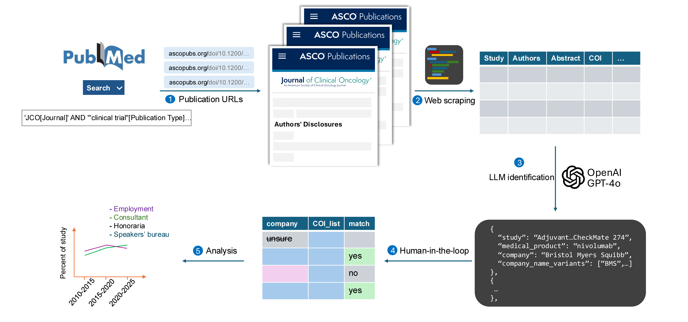

# LLM for Conflicts of Interest Analysis in Oncology Trials

## Overview
This project is a web crawler and data analysis tool designed to extract and analyze conflicts of interest (COIs) from the Journal of Clinical Oncology (JCO) published by the American Society of Clinical Oncology (ASCO). It uses web scraping, natural language processing, and large language models (LLMs) to identify pharmaceutical companies and their products mentioned in clinical trial abstracts.

## Features
- Web scraping of Journal of Clinical Oncology (JCO) publications
- Extraction of clinical trial abstracts, author information, and conflict of interest disclosures
- Identification of pharmaceutical products and their manufacturing companies using LLMs
- Normalization of company name variants for consistent analysis
- Processing and analysis of clinical trial data for research purposes



## Project Structure
- `company_id.py`: Identifies pharmaceutical products and their manufacturing companies from abstracts using OpenAI's API
- `company_clean_name.py`: Normalizes company name variants for consistent analysis
- `config.py`: Configuration file for API keys and environment variables
- `utils/`:
  - `asco_web_scraper.py`: Web scraper for ASCO publications
  - `jco_url_scraper.py`: Extracts URLs from Journal of Clinical Oncology publications
  - `utils.py`: Utility functions for data processing
- `data/`: Contains raw data files including scraped articles and URLs, as well as analysis datasets
- `dataset_processing.ipynb`: Jupyter notebook for data analysis and visualization
- `data_analysis/`: Contains R scripts for statistical analysis and figure generation

## Requirements
- Python 3.8+
- OpenAI API key (stored in `.env` file)
- Required Python packages:
  - openai
  - pandas
  - selenium
  - beautifulsoup4
  - pydantic
  - python-dotenv
  - paperscraper

## Setup and Usage
1. Clone the repository
2. Create a `.env` file in the root directory with your OpenAI API key:
   ```
   OAI_API_KEY=your_api_key_here
   ```
3. Install required packages:
   ```
   pip install -r requirements.txt
   ```
4. Run the JCO URL scraper to collect article URLs:
   ```
   python -m utils.jco_url_scraper
   ```
5. Run the web scraper to collect article data:
   ```
   python -m utils.asco_web_scraper
   ```
6. Process the collected data to identify companies and products:
   ```
   python company_id.py
   python company_clean_name.py
   ```
7. Analyze the results using the Jupyter notebook and save analysis dataset:
   ```
   jupyter notebook dataset_processing.ipynb
   ```

## Data analysis and figure generation
Run R scripts in data_analysis/ for statistical analysis and data visualization 

## Data Flow
1. Collect article URLs from PubMed using the paperscraper library
2. Scrape article content, abstracts, and author disclosures from ASCO publications
3. Process abstracts using LLMs to identify pharmaceutical products and companies
4. Normalize company name variants for consistent analysis
5. Generate analysis datasets 
6. Statistical analysis and data visualization 
